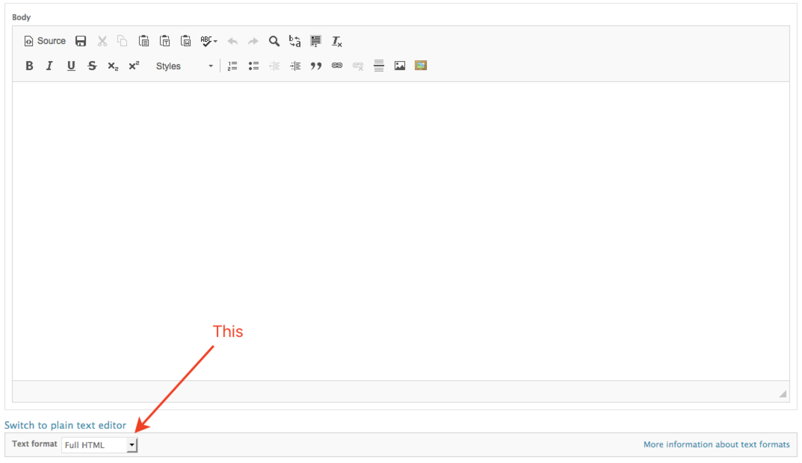

# For editors

## Adding an article

1. Log in at [https://www.bettergov.org/user](https://www.bettergov.org/user)
2. To create an article, click Add Content \(top left of screen\) &gt; Article. Or go the ['Add Article' form](https://www.bettergov.org/node/add/article) directly.
3. Fill out the following fields at bare minimum:
   * Title
   * Author\(s\)
   * Article image
   * Lead image caption
   * Type
   * Issue\(s\)
   * Teaser \(dek\)
   * Body \(see [Authoring the body](for-editors.md#authoring-the-body)\)
4. Save the article as a draft or schedule it for publishing \(see [Scheduling an article](for-editors.md#scheduling-an-article)\)

## Scheduling an article

You can either save your article as a draft \(unpublished\) or schedule it to publish.

#### Saving as draft

To save the article as a draft indefinitely, **do not fill out the publish time**. Doing so will schedule the post to publish in the future. Once done editing, simply hit **save as draft**.

#### Publishing

To publish the article now or in the future, set the **published time**. Use the calendar picker for the date. The time is 24 hour format \(so 15:00 for 3pm\). Finally hit **publish**.

Articles with published times in the future will automatically save as drafts. They will publish at their defined published time.

Articles with published times in the past will automatically publish, regardless of if you hit "save as draft." Just don't schedule posts for the past — it's dishonest.

## Authoring the body

At the bottom of the body text editor, there is a dropdown menu labled **Text format**. There are two options in the dropdown that we want to focus on: Full HTML and Clean paste.



When copying from Word, or Google Docs, or emails, etc. we want to strip as much extra formatting and whitespace as possible. We achieve this through the **Clean paste** text format.

Using it is simple:

1. Select **Clean paste** from the text format dropdown.
2. Copy and paste your article into the textarea.
3. You should get an alert in your browser that says: "Cleaned on paste."
4. That's it! You can switch the dropdown back to **Full HTML** to finish editing the article.


Sometimes the clean paste task doesn't strip all of the whitespace the first iteration. To fix, simply repeat the clean paste process with the once-cleaned text.


## Subheads

We use Heading 3 for subheds. To convert a line to a subhead:

1. Highlight the text
2. Click the Formatting Styles dropdown in the editor tool pane. It will probably say Paragraph, with a down caret next to it.
3. Select the third heading label. It's the smallest blue one.

Subheads are written in sentence case, e.g. Our ruling.

## Adding media

Our current set-up for media management isn't the best. This is a work-in-progress.

**Photos**

1. To upload or insert and already-uploaded photo, click on the color picture frame icon to open IMCE. You can browse the photos from [this link](https://www.bettergov.org/index.php?q=imce) if you're signed in to the site.
2. I try to bin photos by year and month to keep the listings tight, e.g. `articles/2018/01/uploaded-image.jpg`. In the ideal future, this is automated.
3. When you insert the file, the system inserts some annoying inline styles that's difficult to override. So get rid of it. \(Again, ideal future =&gt; automated.\) Go into the source view and delete the text that looks like this: `style="width:700px;height:700px;"`
4. Set the image size, alignment and caption by clicking on the black and white picture frame icon. You can't preview these very well from inside the text editor, so double-check these by previewing the article before you publish.

**Everything else**

For anything else \(graphics, YouTube videos, etc.\), you'll need to insert it via an iframe. You can do this by switching the text editor to source view and pasting the iframe between paragraphs.

By default, the editor will wrap the iframe in a `<p>`tag.

```markup
<p><iframe width="560" height="315" src="https://www.youtube.com/embed/Jnrm02jhzCE" frameborder="0" allow="autoplay; encrypted-media" allowfullscreen></iframe></p>
```

If you'd like, you can manually wrap it in a `<figure>`tag. By doing this, you can add a caption.

```markup
<figure>
<iframe width="560" height="315" src="https://www.youtube.com/embed/Jnrm02jhzCE" frameborder="0" allow="autoplay; encrypted-media" allowfullscreen></iframe>
<figcaption>Our YouTube embed</figcaption>
</figure>
```

## Promoting stories to the front page

We schedule the lead newsroom story on the front page by checking a box that says "Promoted to front page." This is a bit of a misnomer — new articles will show up on the front page, regardless of whether or not we've chosen to promote it. Once you've resolved yourself to the poor choice of phrasing, execute the following steps:

1. Make sure that the selected article type falls under the Newsroom parent — Investigation, Follow-up, Explainer or PolitiFact.
2. Scroll to the very bottom and click on the promotion settings tab.
3. Check "Promoted to front page."
4. If the post is scheduled to publish in the future, it will slide into that lead story slot as soon as it publishes.
5. Once the post is published, manually untick "Promoted to front page" from whatever story was there previously. [Here's a list](https://www.bettergov.org/promoted-to-front-page) of all stories that are promoted and published. There should always be just one.

## Social media parameters

Keep these in mind when penning heds and decks.

#### Twitter

| twitter:site | @bettergov |
| --- | --- | --- | --- | --- | --- |
| _twitter:creator_ | _@username of author_ |
| twitter:description | max 200 characters, desktop only |
| twitter:title | max 70 characters |
| twitter:image | max 5MB |
| _twitter:image:alt_ | _alt text description of image \(max 420 characters\)_ |

#### Facebook \(OpenGraph\)

| og:image | Facebook recommends at least 1200 x 630 pixels |
| --- | --- | --- | --- |
| og:title | long max -- 120 characters? |
| og:description | max 300\(?\) characters, desktop only |
| _og:author_ | _FB follow profile of author_ |

## Extra fields

| Updated | Datetime field. Fill this out if you're updating an already-published article. Also include a description of your changes in the Updates field. |
| --- | --- | --- | --- | --- | --- | --- | --- | --- |
| Series | You can group stories by series \(e.g. [Taking Cover](https://www.bettergov.org/series/taking-cover)\). Begin typing the series and select it from the list, or add a series at [this link](https://www.bettergov.org/admin/structure/taxonomy/series) if it doesn't already exist. |
| Publishing partner | If publishing with a partner organization, fill this out to help keep track of our partnerships. Example: "This story was co-published with the [Chicago Sun-Times](https://chicago.suntimes.com/news/illinois-epa-plan-for-109-million-haul-volkswagen-emissions-scandal-fire-rauner-environment/)." |
| Documentcloud file ID | Adds a DocumentCloud embedded PDF at the bottom of the story \(like in [this article](https://www.bettergov.org/news/illinois%E2%80%99-plan-for-109-million-haul-from-volkswagen-emissions-scandal-draws-fire)\). Open the document in DocumentCloud and copy the piece of the URL after the last slash but before .html. For example, the ID for [this document](https://www.documentcloud.org/documents/4465390-Letter-of-Support-HB-4637.html) is 4465390-Letter-of-Support-HB-4637. |
| Custom URL | For linking to external projects. Paste the full url into this field, and any teasers will take the user to that url instead of the node. |
| Updates | See Updated. |
| Notes | Use this field to add contributing credits, for example. |
| Meta tags | One of the bottom tabs. How the page renders on social media. These pull from the article by default, but you can also manually set them. You'll want to reference the tag documentation \([Facebook](https://developers.facebook.com/docs/sharing/webmasters) \| [Twitter](https://developer.twitter.com/en/docs/tweets/optimize-with-cards/guides/getting-started)\) and the debugger once published \([Facebook](https://developers.facebook.com/tools/debug/) \| [Twitter](https://cards-dev.twitter.com/validator)\). |
| CSS & JavaScript | One of the bottom tabs. Don't touch this unless you know what you're doing! Sometimes there's a need to add CSS or JS for a single article. You can add those via this field. These cache, so you'll need to clear the cache to see the latest CSS or JS applied to the article. |

## PolitiFact articles

We have to post PolitiFact articles in two places: [Our site](for-editors.md#our-site) and [PolitiFact](for-editors.md#politifact)'s.

#### Our site

Follow all the typical steps of [Adding an article](for-editors.md#adding-an-article). **Make sure you set the type to PolitiFact**.

After that, there's just one additional set of fields to fill out. You can open them this way by clicking on the gray bar that starts "Fact check":


You'll see a set of fields for fact-checks only. These mirror fields on PolitiFact's site:

| Fact check type | Statement or Story. Statements check a single statement and have a ruling. Stories are a bit more nebulous and don't have final rulings. |
| --- | --- | --- | --- | --- | --- | --- |
| Quote | The statement being fact-checked. These should be surrounded with quotes where applicable. |
| Person | Who said it. Use titles if relevant \(e.g. Gov. Bruce Rauner\) |
| Context | Where the speaker said it \(e.g. On Twitter\) |
| Date | When the speaker said it. |
| Ruling | True, Mostly True,  Pants on Fire, etc. |
| Sources | Every PolitiFact article should have sources. Use the same process to paste the sources in as you do in [Authoring the body](for-editors.md#authoring-the-body). |

#### PolitiFact

Leave the BGA article editor open when adding the article to PolitiFact — it will be easier to paste text into PolitiFact that's already formatted.

You can access Politifact's CMS from [this link](http://cms.politifact.com/admin/). It's built in Django.

The majority of fact-checks are going to be statements. You can browse and statements from [this link](http://cms.politifact.com/admin/statements/statement/).

On the add statement screen, the mandatory fields will be bolded. The rest are optional. We typically fill out the following, from top to bottom. It seems like a lot, but most of this is just stuff we already filled out on our own site:

* Edition \(Illinois\)
* Author
* Researcher
* Editor
* Speaker
* Subject
* Statement
* Statement type \(usually claim\)
* Statement date
* Statement context
* Art \(the lead art for the article\)
* More Headline Art \(the lead art for the homepage carousel — must be a photo\)
* Ruling
* Ruling headline \(sentence case\)
* Ruling comments \(the article body\)
* Ruling date \(the publish time in ET\)
* Ruling link text \(appears below the truth-o-meter for the ruling on the homepage\)
* Facebook headline & Twitter headline \(60 character limit\)
* Sources

A few other quirks of PolitiFact's setup:

* **Uploading art:** You can browse and add art via the [resources page](http://cms.politifact.com/admin/art/resource/). Typically we'll be adding a photo, a video or an iframe.
  * **Photo:** Select resource type photo, add title and caption, upload the photo \(max size: .5 MB\)
  * **YouTube video:** Select resource type YouTube, add title and caption, add YouTube ID`https://www.youtube.com/watch?v=[YOUTUBE ID]`
  * **Iframe:** Select resource type Infogram / Share the Facts, add title and caption, paste the iframe code into Infogram / Share the Facts.
* **Adding art to the story:** To add art to the body of the story, select it in the field like Figure 1 Art Embed. In the body of the story, switch to source view and paste the embed in the story:

```markup
<p>Some text...</p>
<div class='artembed'>See Figure 1 on PolitiFact.com</div>
<p>Some other text...</p>
```

* **Adding speakers:** If fact-checking someone who hasn't been fact-checked before, you'll need to add the person to the PolitiFact CMS. You can view person at [this link](http://cms.politifact.com/admin/people/person/). The set-up is self-explanatory here, just note these couple of things:
  * It makes you select a political party. If you don't want to, select 'None.' Selecting 'None' means a political party won't show up for that speaker.
  * **Always add a photo.** The photo should be tightly cropped to the person's face, 80x80. You can [crop pictures in Preview](http://osxdaily.com/2014/06/16/crop-image-mac-preview/). Hold shift down while making your selection and the selection will be a square.

#### Share the Facts

PolitiFact asks that we also upload published statements to a service called [Share the Facts](http://politifact.sharethefacts.co/login). We can only do this after the statement is already published.

Once you've filled out the fields, copy the final iframe code, upload it as a resource and embed it at the bottom of the PolitiFact statement. 

