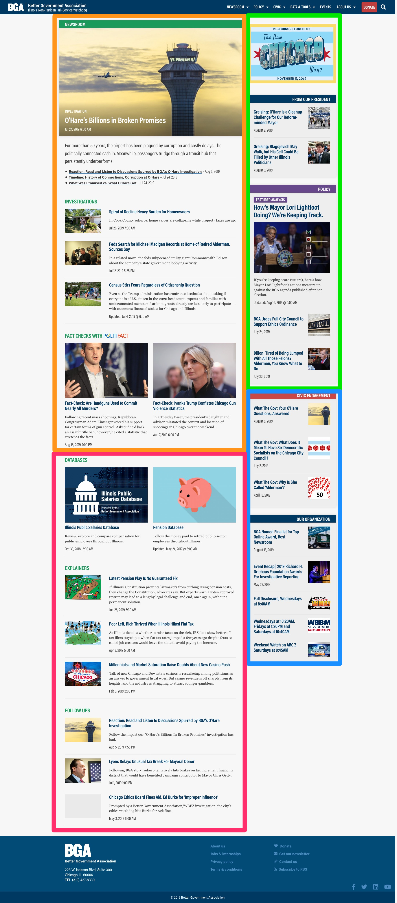
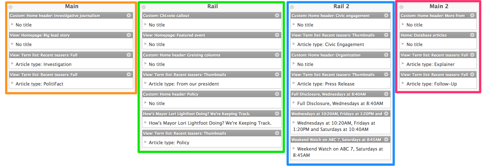
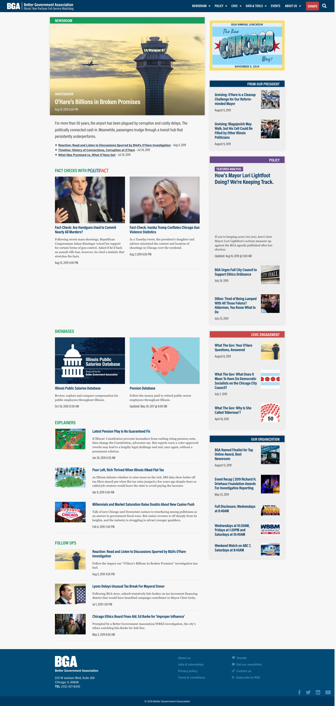
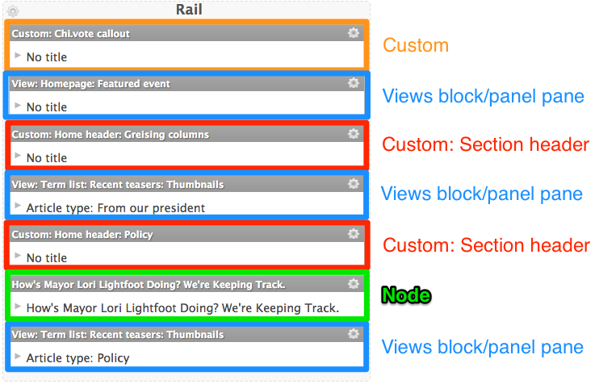
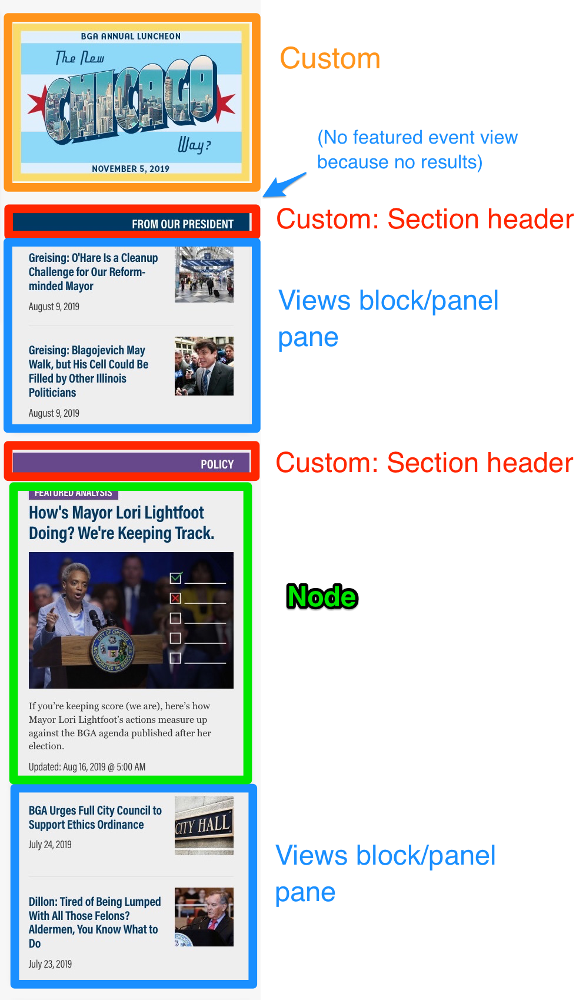
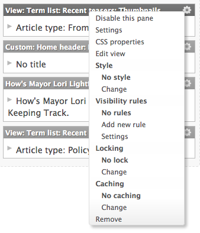
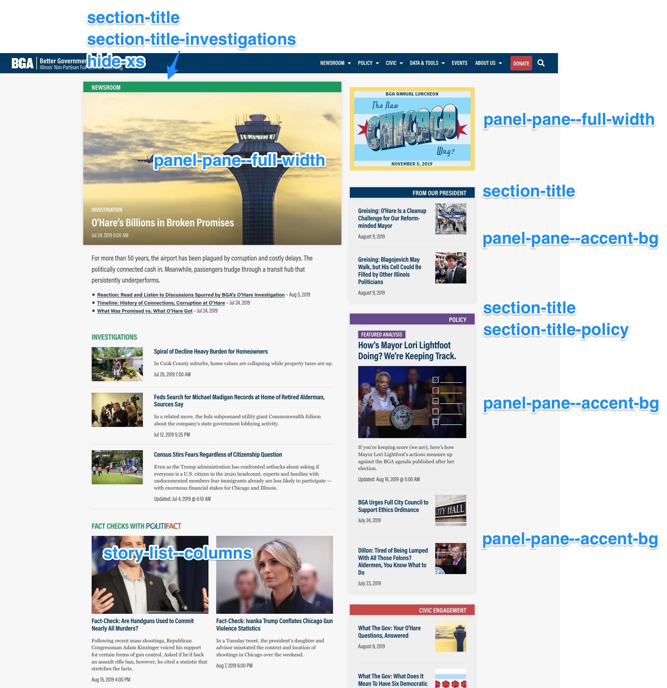

# For administrators

## Accessing our test env

When making a significant configuration change, do it in the test env first and take notes along the way. This prevents unpredictable errors or edits in progress from showing up on our live site.

**To access the test env,** go to [http://test-better-government-association.pantheonsite.io/](http://test-better-government-association.pantheonsite.io/). If you're prompted for a password to see the site, use these credentials:

* Username: `orbit`
* Password: `ab-2012`

When you're comfortable with the changes you've made, replicate them manually in the live site.

## Editing the homepage

Our homepage is built with the module [Panels](https://www.drupal.org/project/panels). This gives us a lot of flexibility and customization, but also a lot to learn. In this section, I will detail some common homepage tasks in this section.

That said, this won't cover every possible use. **The best way to get a handle on the homepage is to just play around with it in the** [**test env**](for-administrators.md#accessing-our-test-env)**.**

### Background: Understanding the layout





Our home page is divided into regions \(the colored blocks above\).

The regions are styled so that on mobile, they stack on one another in order \(Main-Rail-Rail 2-Main 2\), but on desktop, they stack as a main column and a sidebar/rail column.

Be careful that the Rail region isn't taller than the Main region on desktop, otherwise you'll create a gap in content.



### Background: Understanding the content panes

Each region consists of panes — that is, blocks, views, nodes or custom content.





Each pane has a number of settings:



* **Disable this pane:** Hide the pane without deleting it.
* **Settings:** These change from pane type to pane type. For 'View: Term list: Recent teasers', we edit settings like what type of article to show and how many. For custom content, we edit the content itself.
* **CSS properties:** Add an id or classes to the pane.
* **Style:** Prebuilt styles applied to the pane itself. Typically set this to "No style"
* **Visibility rules:** Only show the pane if the context matches the rules.
* **Locking:** Prevent the pane from being moved to a different region.
* **Remove**

Along with the "settings" setting \(ugh\), the CSS properties are the most important setting here; they control the styling but also have the most opportunity for error because we're adding them manually.



### Task: Changing the lead story

See [CMS &gt; For editors &gt; Promoting as lead story on the homepage](for-editors.md#promoting-as-lead-story-on-the-homepage).

### Task: Hiding a story from the homepage

See [CMS &gt; For editors &gt; Hiding a story from the homepage](for-editors.md#hiding-a-story-from-the-homepage).

### Task: Changing the top right "ad" slot

1. When logged in, hover over the top right corner of the rail. A gear icon should appear. Click on it and click "Edit Panel" in the dropdown.
2. From the admin, find the panel Custom: Featured "ad". Click on the gear icon and click "Edit" in the dropdown.
3. This should bring up a rich text editor. Simply change the image and the link.
4. If you want to hide this panel altogether, then from the panel admin, find the panel Custom: Featured "ad", click the gear icon and click "Disable this pane".
5. Finally, don't forget to hit "Update and save" at the bottom of the screen.

## Administering authors

### Creating

To create a new author, navigate to Add Content &gt; Team Member \([direct link](https://www.bettergov.org/node/add/team-member/)\).

If the author is BGA staff:

* Fill in **Name**, **Job Title**, and applicable contact information \(usually **Email** and **Twitter**\)
* Paste their bio in the **Body** and upload a **Team Member Image**
* Finally select their **Team/Bio Group** — this will add them to our [staff page](https://www.bettergov.org/team)

If the author is a BGA intern:

* Fill in **Name**, **Job Title**, and applicable contact information

If the author works for an outside organization:

* Fill in **Name** and **Organization**


It's worth repeating: **Do not select a Team/Bio Group** unless the team member is BGA staff.


### Removing staff

To remove departing staff members:

* Change their **Job Title** to "Former xxxxxx"
* Set their **Team/Bio Group** to "- None -"
* Remove their **Email**

## Administering job listings

### Adding

1. [Add a new article.](https://www.bettergov.org/node/add/article/) Set the type to **Jobs**. Fill out the article and publish it.
2. Once that's published, edit the [Jobs & Internships page](https://www.bettergov.org/jobs-internships). Add the job to the body of the page in two places:

```markup
<h6 id="top">JUMP TO:</h6>
<!-- edit 1: add job to top list -->
<p><a href="#web-graphics-editor">WEB & GRAPHICS EDITOR</a></p>
<!-- end edit -->
<p><a href="#intern">INTERNSHIPS</a></p>

<!-- edit 2: add detailed job listing -->
<hr>
<h3 id="web-graphics-editor">WEB & GRAPHICS EDITOR</h3>
<p>We're seeking a Web & Graphics Editor to lead our digital publishing and design efforts.</p>
<a href="/news/bga-is-hiring-a-web-graphics-editor">Full job listing ➔</a>
<!-- end edit -->
```

### Removing

1. Take the job down from the [Jobs & Internships page](https://www.bettergov.org/jobs-internships).
2. Edit the job listing itself. At the top of the body, add a paragraph noting that the job listing is no longer open, e.g. "Applications for this position are no longer being considered."

## Administering CMS users

### Adding

To create a new CMS user:

* Navigate to Administration &gt; People &gt; Add user \([direct link](https://www.bettergov.org/admin/people/create/), administrators only\)
* Fill out the form
* At the bottom, check **Client Administrator** and **Notify user of new account**
* Save

### Blocking

To remove departing staff members:

* Edit the user \(select them from [this list](https://www.bettergov.org/admin/people/)\), select **Status** &gt; **Blocked**, and save

