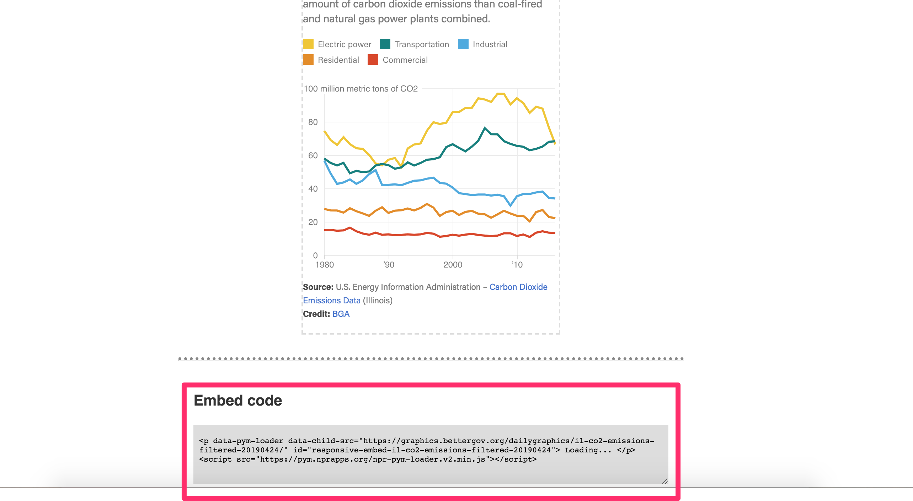

# For editors

## Logging in

Go to [https://www.bettergov.org/user](https://www.bettergov.org/user)

## Adding an article

1. To create an article, click Add Content \(top left of screen\) &gt; Article. Or go the ['Add Article' form](https://www.bettergov.org/node/add/article) directly.
2. Fill out the following fields at bare minimum:
   * Title
     * Capitalize by pasting into [titlecase.com](http://titlecase.com) and use AP Style Title Case
   * Author\(s\)
   * Type
   * Article image \(editorial\)
   * Article image \(SEO\)
   * Lead image caption
     * Style caption and credit like so: `Michael Zalewski was alderman of Chicago's 23rd ward for over two decades. (Bill Healy/WBEZ)`
   * Teaser \(deck\)
   * Body \(see [Authoring the body](for-editors.md#authoring-the-body)\)
3. Save the article as a draft or schedule it for publishing \(see [Scheduling an article](for-editors.md#scheduling-an-article)\)

## Scheduling an article

You can either save your article as a draft \(unpublished\) or schedule it to publish.

#### Saving as draft

To save the article as a draft indefinitely, **do not fill out the publish time**. Doing so will schedule the post to publish in the future. Once done editing, simply hit **save as draft**.


#### Publishing

To publish the article now or in the future, set the **published time**. Use the calendar picker for the date. The time is 24 hour format \(so 15:00 for 3pm\). Finally hit **publish**.

Articles with published times in the future will automatically save as drafts. They will publish at their defined published time.

Articles with published times in the past will automatically publish, regardless of if you hit "save as draft."

## Adding a new author

See [CMS &gt; For administrators &gt; Creating](for-administrators.md#creating)

## Authoring the body

At the bottom of the body text editor, there is a dropdown menu labeled **Text format**. There are two options in the dropdown that we want to focus on: Full HTML and Clean paste.


When copying from Word, or Google Docs, or emails, etc. we want to strip as much extra formatting and whitespace as possible. We achieve this through the **Clean paste** text format.

Using it is simple:

1. Select **Clean paste** from the text format dropdown.
2. Copy and paste your article into the textarea.
3. You should get an alert in your browser that says: "Cleaned on paste."
4. That's it! You can switch the dropdown back to **Full HTML** to finish editing the article.


Sometimes the clean paste task doesn't strip all of the whitespace the first iteration. To fix, simply repeat the clean paste process with the once-cleaned text.


## Adding subheds


To convert a line to a subhead:

1. Highlight the text
2. Click the Formatting Styles dropdown in the editor tool pane. It will probably say Paragraph, with a down caret next to it.
3. Select the label marked 'Subhed'.

Subheads are written in sentence case, e.g. Our ruling.

## Adding photos


1. **URL:** the location of the file itself
   * Click the browse server button and either upload a new image or select an uploaded image
   * Click "Insert file" when you've found the photo you want
2. **Alternative text:** A plaintext description of the photo for screen-readers \(e.g. for visually-impaired users\)
3. **Width and height:** Manually adjust the width or height of the image; this is rarely touched
4. **Alignment:**
   * **None**: Left justifies the image \(like in Google Docs, Word\)
   * **Left**: Floats the image left on tablet and higher, centers the image on mobile; max-width of 300px
   * **Center**: Centers the image
   * **Right**: Floats the image right on tablet and higher, centers the image on mobile; max-width of 300px
5. **Captioned image:** If you're adding a caption, check this box. It will create a field you can edit in the text editor.

## Adding refers to other stories

You can add references to other articles in the body of a story. 

#### 1. Copy and paste the below code into the "Source" view of the body field

```markup
<aside class="align-right">
    [[nid:xxxxxxx view_mode=horizontal_teaser]]
</aside>
```

#### 2. Change the nid value to match the node id of article you're referencing

* To get an article's node id, go to the article, then click edit. The nid will be in the url.
* For example:
  * I want to embed a refer to the article [Censo genera miedo sobre pregunta de ciudadanía ](https://www.bettergov.org/news/censo-genera-miedo-sobre-pregunta-de-ciudadan-a/)
  * I go to the article and click edit
  * From the edit page's url \([https://www.bettergov.org/node/1401942/edit/](https://www.bettergov.org/node/1401942/edit/)\), I copy the nid 1404942

```markup
<aside class="align-right">
    [[nid:1404942 view_mode=horizontal_teaser]]
</aside>
```


#### 3. \(Optional\) Add an additional heading to the refer

```markup
<aside class="align-right">
    <h6>En español:</h6>
    <hr style="margin: .2rem 0" />
    [[nid:1401942 view_mode=horizontal_teaser]]
</aside>
```


## Adding embeds \(YouTube, graphics, etc.\)

#### Automatic embeds via iFramely

For supported media embeds \(e.g. YouTube videos, tweets\), you can copy and paste the url directly into the body field while in the Full HTML view to automatically insert a responsive embed.


The full list of supported embeds is available on [iFramely](https://iframely.com/features).

#### Manual embeds \(graphics, etc.\)

Sometimes, you'll just need to manually insert some html — iframes, graphic embeds, etc.

Go to source view and paste the raw html.




## Promoting as lead story on the homepage


Note to administrators/developers: See Drupal view [Homepage: Big lead story](https://www.bettergov.org/admin/structure/views/view/homepage_top_story/edit/) for implementation details.


We schedule the lead newsroom story on the front page by checking a box that says "Promoted to front page." This is a misnomer — new articles will show up on the front page, regardless of whether or not we've chosen to promote it. But they won't show up in that main image box.

1. Make sure that the selected article type falls under the Newsroom parent.
2. Scroll to the very bottom and click on the promotion settings tab.
3. Check "Promoted to front page."
4. If the post is scheduled to publish in the future, it will slide into that lead story slot as soon as it publishes.



The lead story spot will populate with the story marked promoted that's either published or updated most recently. Here's an example scenario:

* August 1: Story A published, Story A in lead slot
* August 2: Story B published, Story B in lead slot
* August 3: Story A marked updated, Story A in lead slot


## Hiding a story from the homepage

To hide a story from the homepage, under Promotion settings, check "Sticky at top of lists."

Like the previous section, ignore the wording of the action. Just think of "sticky" as equivalent to "hidden from homepage."


## Sharing a preview

You can share a link to unpublished content, e.g. to let partner organizations see our draft.

Once logged in, you should see a green alert at the top of the unpublished article, on both the article and the edit screen. Right click on 'hashed link' and copy the link address.


## Making an article republishable

All of our republishable articles are listed at [bettergov.org/republishing](https://www.bettergov.org/republishing/).

See the below screenshots for an example. [You can also view this example in your browser.](https://www.bettergov.org/node/1401909/republish)


### Sharing unpublished articles for republishing

You can share a hashed republish link to share unpublished articles with partners.

It would look something like: [https://www.bettergov.org/node/1401966/republish/?hash=xNhpl\_tHmF7RzM1C3rRTntd1PD80Wi9D3plZsZqhxqU](https://www.bettergov.org/node/1401966/republish/?hash=xNhpl_tHmF7RzM1C3rRTntd1PD80Wi9D3plZsZqhxqU) \(not a real link\)

An easy way to get this link is to scroll to the republish widget at the bottom of the article and copy the link location.


## Adding an off-platform article

Example on projects.bettergov.org: [https://projects.bettergov.org/2019/ohare/investigation-billions-broken-promises/](https://projects.bettergov.org/2019/ohare/investigation-billions-broken-promises/)

Example in Drupal: [https://www.bettergov.org/node/1401950/edit/](https://www.bettergov.org/node/1401950/edit/)

01. Create the article in our Drupal CMS. Fill out all of the fields as if it were going to post on bettergov.org so that it can be properly indexed by our site search.


02. Under 'Additional fields', set a 'Custom URL.' Teasers will link to this URL.


03. Create a URL redirect. Select 'URL redirects' in the bottom tabs. Then click "add URL redirect to this content." Then paste the node URL in the from field and your custom URL in the to field.


## Social media parameters

Keep these in mind when penning heds and decks.

#### Twitter

|  |  |
| :--- | :--- |
| twitter:site | @bettergov |
| _twitter:creator_ | _@username of author_ |
| twitter:description | max 200 characters, desktop only |
| twitter:title | max 70 characters |
| twitter:image | max 5MB |
| _twitter:image:alt_ | _alt text description of image \(max 420 characters\)_ |

#### Facebook \(OpenGraph\)

|  |  |
| :--- | :--- |
| og:image | Facebook recommends at least 1200 x 630 pixels |
| og:title | long max -- 120 characters? |
| og:description | max 300\(?\) characters, desktop only |
| _og:author_ | _FB follow profile of author_ |

## Extra fields

|  |  |
| :--- | :--- |
| Updated | Datetime field. Fill this out if you're updating an already-published article. Also include a description of your changes in the Updates field. |
| Series | You can group stories by series \(e.g. [Taking Cover](https://www.bettergov.org/series/taking-cover)\). Begin typing the series and select it from the list, or add a series at [this link](https://www.bettergov.org/admin/structure/taxonomy/series) if it doesn't already exist. |
| Additional fields &gt; Publishing partner | If publishing with a partner organization, fill this out to help keep track of our partnerships. Example: "This story was co-published with the [Chicago Sun-Times](https://chicago.suntimes.com/news/illinois-epa-plan-for-109-million-haul-volkswagen-emissions-scandal-fire-rauner-environment/)." |
| Additional fields &gt; Documentcloud file ID | Adds a DocumentCloud embedded PDF at the bottom of the story \(like in [this article](https://www.bettergov.org/news/illinois%E2%80%99-plan-for-109-million-haul-from-volkswagen-emissions-scandal-draws-fire)\). Open the document in DocumentCloud and copy the piece of the URL after the last slash but before .html. For example, the ID for [this document](https://www.documentcloud.org/documents/4465390-Letter-of-Support-HB-4637.html) is 4465390-Letter-of-Support-HB-4637. |
| Additional fields &gt; Updates | Fill this out if you're updating an already-published article. This should be a description of your changes. |
| Additional fields &gt; Notes | Use this field to add contributing credits, for example. |
| Meta tags | One of the bottom tabs. These pull from the article by default, but you can also manually set them. You'll want to reference the tag documentation \([Facebook](https://developers.facebook.com/docs/sharing/webmasters) \| [Twitter](https://developer.twitter.com/en/docs/tweets/optimize-with-cards/guides/getting-started)\) and the debugger once published \([Facebook](https://developers.facebook.com/tools/debug/) \| [Twitter](https://cards-dev.twitter.com/validator)\). |
| CSS & JavaScript | One of the bottom tabs. Don't touch this unless you know what you're doing! Sometimes there's a need to add CSS or JS for a single article. You can add those via this field. |

## PolitiFact articles

We have to post PolitiFact articles in two places: [Our site](for-editors.md#our-site) and [PolitiFact](for-editors.md#politifact)'s.

#### Our site

Follow all the typical steps of [Adding an article](for-editors.md#adding-an-article). **Make sure you set the type to PolitiFact**.

After that, there's just one additional set of fields to fill out. You can open them this way by clicking on the gray bar that starts "Fact check":


You'll see a set of fields for fact-checks only. These mirror fields on PolitiFact's site:

| Fact check type | Statement or Story. Statements check a single statement and have a ruling. Stories are a bit more nebulous and don't have final rulings. |
| :--- | :--- |
| Quote | The statement being fact-checked. These should be surrounded with quotes where applicable. |
| Person | Who said it. Use titles if relevant \(e.g. Gov. Bruce Rauner\) |
| Context | Where the speaker said it \(e.g. On Twitter\) |
| Date | When the speaker said it. |
| Ruling | True, Mostly True,  Pants on Fire, etc. |
| Sources | Every PolitiFact article should have sources. Use the same process to paste the sources in as you do in [Authoring the body](for-editors.md#authoring-the-body). |

#### PolitiFact

Leave the BGA article editor open when adding the article to PolitiFact — it will be easier to paste text into PolitiFact that's already formatted.

You can access Politifact's CMS from [this link](http://cms.politifact.com/admin/). It's built in Django.

The majority of fact-checks are going to be statements. You can browse and statements from [this link](http://cms.politifact.com/admin/statements/statement/).

On the add statement screen, the mandatory fields will be bolded. The rest are optional. We typically fill out the following, from top to bottom. It seems like a lot, but most of this is just stuff we already filled out on our own site:

* Edition \(Illinois\)
* Author
* Researcher
* Editor
* Speaker
* Subject
* Statement
* Statement type \(usually claim\)
* Statement date
* Statement context
* Art \(the lead art for the article\)
* More Headline Art \(the lead art for the homepage carousel — must be a photo\)
* Ruling
* Ruling headline \(sentence case\)
* Ruling comments \(the article body\)
* Ruling date \(the publish time in ET\)
* Ruling link text \(appears below the truth-o-meter for the ruling on the homepage\)
* Facebook headline & Twitter headline \(60 character limit\)
* Sources

A few other quirks of PolitiFact's setup:

* **Uploading art:** You can browse and add art via the [resources page](http://cms.politifact.com/admin/art/resource/). Typically we'll be adding a photo, a video or an iframe.
  * **Photo:** Select resource type photo, add title and caption, upload the photo \(max size: .5 MB\)
  * **YouTube video:** Select resource type YouTube, add title and caption, add YouTube ID`https://www.youtube.com/watch?v=[YOUTUBE ID]`
  * **Iframe:** Select resource type Infogram / Share the Facts, add title and caption, paste the iframe code into Infogram / Share the Facts.
* **Adding art to the story:** To add art to the body of the story, select it in the field like Figure 1 Art Embed. In the body of the story, switch to source view and paste the embed in the story:

```markup
<p>Some text...</p>
<div class='artembed'>See Figure 1 on PolitiFact.com</div>
<p>Some other text...</p>
```

* **Adding speakers:** If fact-checking someone who hasn't been fact-checked before, you'll need to add the person to the PolitiFact CMS. You can view person at [this link](http://cms.politifact.com/admin/people/person/). The set-up is self-explanatory here, just note these couple of things:
  * It makes you select a political party. If you don't want to, select 'None.' Selecting 'None' means a political party won't show up for that speaker.
  * **Always add a photo.** The photo should be tightly cropped to the person's face, 80x80. You can [crop pictures in Preview](http://osxdaily.com/2014/06/16/crop-image-mac-preview/). Hold shift down while making your selection and the selection will be a square.

#### Share the Facts

PolitiFact asks that we also upload published statements to a service called [Share the Facts](http://politifact.sharethefacts.co/login). We can only do this after the statement is already published.

Once you've filled out the fields, copy the final iframe code, upload it as a resource and embed it at the bottom of the PolitiFact statement. 

